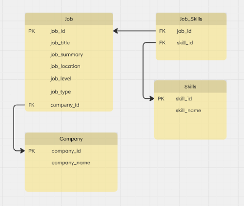

## Overview / Introduction

```{r setup, include=FALSE}
knitr::opts_chunk$set(echo = TRUE)

library(dplyr)
library(dbplyr)
library(tidyr)
library(tidyverse)
library(tibble)
library(rvest)
library(rlist)
library(readr)
library(XML)
library(xml2)
library(jsonlite)
library(arrow)
library(stringr)
library(digest)
library(duckdb)
library(ggplot2)
```

## Overview 

For Project 3, our team was asked to answer the question, _Which are the most valued data science skills?_ To answer this question, we decided to explore the top skills that companies search for in a job candidate. We sourced data from [Indeed](https://indeed.com/), a popular job listing site. We were able to source a [dataset](https://www.kaggle.com/datasets/asaniczka/data-science-job-postings-and-skills) featuring over 12,000 US Data Science jobs scraped from Indeed in January 2024<sup>*</sup>.

We began by normalizing the dataset to match our proposed Entity Relationship Diagram (ERD) shown below:

. 

We have broken out our normalization process into a separate document in an attempt to only show how we would work directly with an existing relational database within this file. For details on how we normalized the dataset, review  the [Team5-Project3-normalize-and-export-source.Rmd](https://github.com/mcastro64/D607_Project3/blob/bcdc0748160cd2e9abca7ece7aff03f774bfda12/Team5-Project3-normalize-and-export-source.Rmd) file on the project's Github repo.


### Reading the original dataset files

After inspecting the Indeed dataset files, we noticed that while the files did not have an id column, each job listing, job summary, and job skills could be identified by the listings URL (_job_link_ field). Because this field is a bit verbose, we cleaned up this field using a custom function __convert_key__. The __convert_key__ function accepts a dataframe (_df_), then mutates it by dropping the domain name then using the page slug to create a hash using __digest__. This function will be called to create a unique id for each job and will allow us to join tables as necessary.

Next, we imported the  job summary, job listing, and job skills files one at a time and cleaning their corresponding dataframes with the columns that we idenfied in our database schema represented in our [Entity Relationship Diagram](https://miro.com/app/board/uXjVLPb_3f0=/).

```{r read-csvs}

# function to create a primary key column from the url
convert_key <- function (df) {
  df |> mutate(
    job_id = str_extract(job_link, "\\/[^\\/]*$"),
    job_id = map_chr(job_id, digest, algo = 'md5', seed = 1234)
  ) |>
  relocate(job_id)
}

# read in job summary csv
orig_job_summary <- read_csv("source_files/job_summary.csv") |>
  convert_key() |>
  subset(select = -c(job_link))

# read in job postings csv
orig_job_postings <- read_csv("source_files/job_postings.csv") |>
  convert_key()

# subset companies and add col id  
companies_df <- subset(orig_job_postings, select = c(company)) |>
  distinct(company) |>
  mutate(company_id = row_number()) |>
  relocate(company_id, .before = "company") 

# add job description and subset
jobs_df <- orig_job_postings |> 
  left_join(orig_job_summary, join_by(job_id == job_id)) |> # add Job Description
  subset(select = c(job_id, job_title, job_summary, job_location, search_position, job_level, job_type, company)) |>
  left_join(companies_df, join_by(company == company)) |>   # add Job Company field
  subset(select = -c(company))

```

### Creating the Skills and Job_Skills Joining Table

In this section, we create a "skills" dataframe and a joiner "job_skills" dataframe. I start by reading in the job skills, transform the url field into a hash to use as the foreign key to connect with the job record, subset with just the fields _job_id_ and _job_skills_, and used __separate_longer_delim_ to break up the _job_skills_ field into separate rows, using a comma deliminator. I will need to update this dataframe later to replace each skill listed in the _skill_name_ column with its unique id. 

To create the "skills" dataframe, I first copy the "job_skills" dataframe, use __distint__ to remove the duplicates, than add a row number to use as the _skill_id_ field. This essentially leaves a table of unique skills with their respective Id.

As a final step, I use __left_join__ to join my "skills" dataframe to the "job_skills" dataframe by the _skill_name_ field. Dropping the _skill_name_ leaves two columns: 
1. _job_id_ which will serve as a foreign key to join with my "jobs" dataframe or SQL table, and
2. _skill_id_ which will serve as a foreign key to join with my "skills" table or SQL table


```{r create-joiner-table}

# create joiner table
job_skills_dirty <- read_csv("source_files/job_skills.csv") |>
  convert_key() |>
  subset(select = c(job_id, job_skills)) |>
  rename(skill_name = job_skills)

# create joiner table
job_skills_distinct <- job_skills_dirty  |>
  separate_longer_delim(cols = c(skill_name), delim="," )

# make distinct list of unique skills and give them their own id
skills_distinct <- job_skills_distinct |>
  distinct(skill_name) |>
  mutate(skill_id = row_number()) |>
  relocate(skill_id, .before = skill_name)

# update joiner to bring unique artist idea 
job_skills_distinct <- job_skills_distinct |>
  left_join(skills_distinct, join_by(skill_name == skill_name)) |>
  subset(select=-c(skill_name))
```

### Export Files

This next section writes the data frames as Parquet files. Since Parquet is binary format, I am also exporting the dataframes to .CSV to be able to examine the outputs. 

```{r export-files}
# write parquet files
write_parquet(jobs_df, "datasets/jobs.parquet")
write_parquet(companies_df, "datasets/companies.parquet")
write_parquet(skills_distinct, "datasets/skills.parquet")
write_parquet(job_skills_distinct, "datasets/job_skills.parquet")
```

### Reading the Normalized Dataset

We used [DuckDB](https://duckdb.org/), a popular open-source embeddable database to manage our relational database. We chose DuckDB as way to try working with a different type of database within R and for its portability — though we don't recommend storing sensitive data in a public repository as we have for this exercise. 

After loading the __duckdb__ package, we initialized DuckDB by establishing a connection (#A1) and importing our pre-normalized database parquet files (#A2). Next, we used SQL to join the tables into a single dataframe (#A3).

```{r init-db-connection}

# A1. make an in-memory db and store the connection in a variable
con <- dbConnect(duckdb::duckdb())

# A2. read parquet files and register them as tables to the database
tables <- c('jobs','skills','job_skills','companies')
for (t in tables) {
  parquet_file <- paste('datasets/',t,'.parquet', sep="")
  duckdb_register(con, t, read_parquet(parquet_file))
}

# show what we loaded
glimpse(tbl(con, "jobs"))
glimpse(tbl(con, "skills"))
glimpse(tbl(con, "job_skills"))
glimpse(tbl(con, "companies"))


# A3. join the tables with SQL and save as dataframe
full_df <- dbGetQuery(con,"WITH skills_by_id AS (
                    SELECT job_id,
                      STRING_AGG (skill_name, ',' ) AS skills
                    FROM job_skills AS x
                    LEFT JOIN skills AS s 
                      ON s.skill_id = x.skill_id 
                    GROUP BY job_id
                  )

                  SELECT j.*, c.company, s.skills
                  FROM jobs AS j
                  LEFT JOIN skills_by_id AS s
                      ON s.job_id = j.job_id 
                  LEFT JOIN companies AS c
                    ON c.company_id = j.company_id
            ")

glimpse(full_df)

```

### Data Tidying


```{r}

# 1. Standardize Column Names
full_df <- full_df %>%
  rename_all(~str_to_lower(.)) %>%    # Convert all column names to lowercase
  rename_all(~str_replace_all(., " ", "_")) # Replace spaces with underscores

# 2. Remove Duplicates
full_df <- full_df %>%
  distinct()  # Keep only unique rows

# 3. Handle Missing Values
# Replace NA values with 'Unknown' in character columns
full_df <- full_df %>%
  mutate(across(where(is.character), ~replace_na(., "Unknown")))

# Display the cleaned data frame
glimpse(full_df) #the head() command produces a huge output in the HTML, what do you think about using glimpse()

```


```{r}

# Assuming 'full_df' contains job postings and skill information

# 1. Separate the skills column back into individual rows, renaming it to "skill_name":
skill_counts <- full_df %>%
  separate_rows(skills, sep = ",") %>%    # Split skills by commas into individual rows
  rename(skill_name = skills) %>%         # Rename the column to "skill_name"
  mutate(skill_name = str_trim(skill_name)) %>%  # Remove extra spaces around skill names
  count(skill_name, sort = TRUE) %>%      # Count occurrences of each skill and sort by frequency
  rename(frequency = n)                   # Rename count column to 'frequency'

# 2. Display the top skills
head(skill_counts, 10)  # Show the top 10 skills by frequency
```

```{r}

# Plot the top 10 skills
ggplot(skill_counts %>% head(10), aes(x = reorder(skill_name, -frequency), y = frequency)) +
  geom_bar(stat = "identity") +
  labs(title = "Top 10 Skills in Data Science Job Postings",
       x = "Skill",
       y = "Frequency") +
  theme_minimal() +
  theme(axis.text.x = element_text(angle = 45, hjust = 1))

```

```{r}

# List of text columns to normalize
text_columns <- c("job_title", "job_summary", "job_location", "search_position", "company")

# Apply normalization to each text column
full_df <- full_df %>%
  mutate(across(all_of(text_columns), ~ str_trim(tolower(.))))

# Display the first few rows of the updated dataset
glimpse(full_df) #the head() command produces a huge output in the HTML, what do you think about using glimpse()

```

### Data Analysis
Diving deeper into analysis, we can check to see if the top 10 skills are influenced by the job level. Our data contains two values for the `job_level` field, 'Mid senior' and 'Associate.' We will take the same approach we did for the `skill_counts` data frame and make sure to include `job_level` in our output. Once we create the `skill_by_level` data frame, we will use it to merge two subsets filtered for each job title and combined through the row name. Doing so produces the table seen below.
```{r skill by level}

#Skill frequency by job level
skill_by_level <- full_df %>%
  separate_rows(skills, sep = ",") %>%    # Split skills by commas into individual rows
  rename(skill_name = skills) %>%         # Rename the column to "skill_name"
  mutate(skill_name = str_trim(skill_name)) %>%  # Remove extra spaces around skill names
  group_by(skill_name,job_level) %>% 
  count(job_level, sort = TRUE) %>%      # Count occurrences of each skill and sort by frequency
  rename(frequency = n)

#Comparison of top 10 skills based on job level
job_level_comparison <- merge(
  skill_by_level %>% 
    filter(job_level=='Mid senior') %>% 
    head(10),
  skill_by_level %>% 
    filter(job_level=='Associate') %>% 
    head(10),
  by='row.names'
) %>% 
  arrange(desc(frequency.x)) %>% 
  rename(top_mid_senior_skill = skill_name.x,
         top_associate_skill = skill_name.y) %>% 
  select(2,5)

print("Top 10 Skills by Job Level:")
job_level_comparison

```

The above data frame illustrates the slight differences in skills that exist between 'Mid senior' and 'Associate' level positions. Below, are a few more interesting statistics regarding the job titles, companies, and regions within our data set. The first one tabulates the top job titles within our data set which seems to be filled by mostly 'Mid senior,' engineer and analytics positions. The next one gives a glimpse into which companies have the most amount of job postings. Interestingly enough, a bit of research comes to show that the majority of these are recruiting companies. Last, but not least, we have a distribution of the regions with the most job postings. Out of the 10 listed, the majority of them fall on the east coast United Sates, save California, Texas, the UK, and Illinois.
```{r other distributions}

#Distribution of top job titles, companies, and regions
job_title_distribution <- full_df %>%
  count(job_title, sort = TRUE) %>%
  head(10)  # Top 10 job titles

company_distribution <- full_df %>%
  count(company, sort = TRUE) %>%
  head(10)  # Top 10 companies

regional_distribution <- full_df %>%
  mutate(region=str_replace(job_location,'(.*?),(.*?)', '\\2')) %>% 
  count(region, sort = TRUE) %>%
  head(10)  # Top 10 regions

print("Top 10 Job Titles by Frequency:")
print(job_title_distribution)

print("Top 10 Companies by Frequency:")
print(company_distribution)

print("Top 10 Regions by Frequency:")
print(regional_distribution)

```

## Conclusions / Limitations and Recommendations

This project relied on a [pre-assembled webscrape](https://www.kaggle.com/datasets/asaniczka/data-science-job-postings-and-skills) of job listings on Indeed for the "Data Science" positions which was compiled in January 2024. It represents a snapshot of common skills that employers were search on a single job listing site at a particular time and may not be fully representative of the overall most important data skills. We would need current data to compare whether the top skills of our work continue to be important today or to data from additional sources to cross-check. 

While we attempted to scrape the Indeed site as part of this work, we ran into some authorization issues that prevented us from recreating a current dataset. However, we were able to scrapte a [dataset](https://github.com/mcastro64/D607_Project3/blob/bcdc0748160cd2e9abca7ece7aff03f774bfda12/Team5-Project3-scraper.Rmd) from an UK-based jobs engine, which could be used to compare the differences between US and UK tops skills in. future version of this project.


---

<small><sup>*</sup> Our team made an attempt to scrape current data from Indeed, but were unable to replicate the procedure. For demonstrative purposes, we were able to (scrape data](https://github.com/mcastro64/D607_Project3/blob/bcdc0748160cd2e9abca7ece7aff03f774bfda12/Team5-Project3-scraper.Rmd) another source</small>
